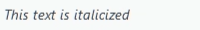
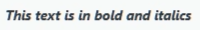
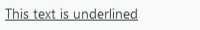
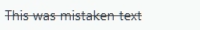
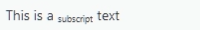
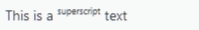

# Fluvel
Fluvel es un framework de Python diseñado para simplificar y acelerar la creación de interfaces gráficas de usuario (GUI) elegantes y complejas. Se basa en PySide6 y propone una arquitectura de diseño MVC, por lo que aprovecha las robustas capacidades del framework Qt y la consistencia del patrón MVC para ofrecer una experiencia de desarrollo más intuitiva y declarativa.
También cuenta con DSLs (Domain Specific Languages) propios creados para centralizar, agilizar y simplificar la gestión de Menús y contenido estático de la aplicación.

## Toolkit And Patterns

## Diseño Reactivo Basado en Señales de PySide6

## Diseña las **Vistas** a través de la `clase` `ViewBuilder` 

## Fluvel In Action. Demostrations
### Cómo crear menús a través de archivos `.fluml`
Pequeña demostración construyendo los típicos menús de las aplicaciones usando el lenguaje `fluml`. 
<br>
```
[File]:

    new_text_file = "New Text File"
    new_file = "New File..."

    @SaveAndExportSection
    save = "Save"
    save_as = "Save As..."
    [Export]:
        export = "Export"
        export_as = "Export As..."
    
    @QuitSection
    quit = "Quit"

[Help]:

    about = "About"
    licence = "Licence"

    @MoreSection
    [More]:
        author = "Author"
        version = "Version"
...
```
<!-- ## Reglas sintácticas
| Action | Syntax | Example | Representation |
| --- | --- | --- | --- |
| Inline Comments | `#` | ` # inline-comment` | *an inline comment* |
| Menu or Submenu | `[ ]:` | `[File]:` | ** -->

## Reglas de estilo y funcionalidad
| Style | Syntax | Example | Result | Comments
| --- | --- | --- | --- | --- |
| Italic | `* *` | `*This text is italicized*` |  | --- |
| Bold | `** **` | `**This is bold text**` | | --- |
| Bold and Italic | `*** ***` | `****This text is in bold and italics****` | | --- |
| Underline | `__ __` | `__This text is underlined__` |  | --- |
| Line Through | `-- --` | `--This was mistaken text--` |  | --- |
| Subscript | `<sub> </sub>` | `This is a <sub>subscript</sub> text` |  | --- |
| Superscript | `<sup> </sup>` | `This is a <sup>superscript</sup> text` |  | --- |
| Link | `{ text \| url }` | `Check our {GitHub \| https://www.github.com} page.` |  | --- |
| Placeholders | `$0, $1, etc..` | `Hello! my name is $0.` |  | *The marker `$0` can be replaced with an instance of `str` or `StringVar`*. |

## Hot-Reloading