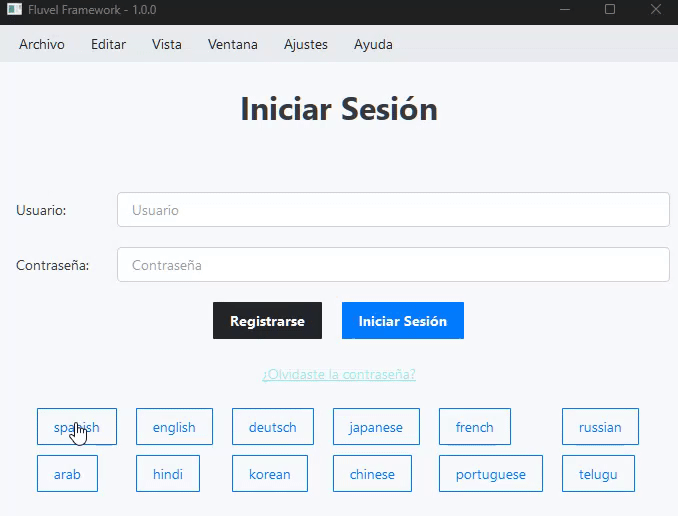

<p align="center">
  <picture>
    <source media="(prefers-color-scheme: dark)" srcset="./assets/logo-dark.svg">
    
  </picture>
</p>

<div align="center">


</div>

<p align="center">Un framework moderno y declarativo para crear interfaces de usuario con PySide6</p>

## ⚠️ Estado Actual: Versión Beta (0.1.0b1)
**Fluvel** se encuentra en una fase temprana de desarrollo.

Esta es una versión preliminar publicada con fines de prueba y retroalimentación. La API puede cambiar, y es posible que encuentres errores o características incompletas. No se recomienda su uso en entornos de producción.

## ¿Qué es **Fluvel**?
**Fluvel** es un framework construido sobre **PySide6** que busca simplificar y modernizar el desarrollo de aplicaciones de escritorio en Python. <br/>
Su principal filosofía es reducir el código repetitivo (boilerplate) y permitir a los desarrolladores crear interfaces complejas de una manera más intuitiva y mantenible.

<table>
<tr>
<td>

### Características Principales

* **Creación declarativa de vistas**: Diseña `vistas` con `ViewBuilder`, una clase abstracta que permite definir interfaces de forma sencilla, declarativa e intuitiva usando manejadores de contexto.
* **UI Reactiva**: Utiliza un sistema de `StringVars` para actualizar automáticamente la interfaz cuando los datos cambian. No necesitas manipular los *widgets* directamente.
* **Motor de temas "Utility-First"(`QSS`)**: La apariencia de las aplicaciones se personaliza con archivos QSS. Fluvel utiliza un sistema de "clases" (style="primary") inspirado en frameworks como Tailwind CSS, permitiendo un diseño rápido y consistente.
* **Internacionalización (i18n)**: Gestiona todo el contenido estático y dinámico desde archivos `.fluml`. Esto facilita la traducción y la adaptación del contenido sin tener que modificar el código.
* **Separación de Contenido**: El contenido del menú, las etiquetas y los textos de ayuda se gestionan fuera del código, permitiendo que diseñadores o traductores trabajen de forma independiente.
* **CLI integrada**: Cuenta con una CLI con comandos útiles que agilizan y facilitan el desarrollo y despliegue de aplicaciones.
* **Hot-Reloader**: Incorpora un sistema de Hot-Reloading eficiente que actualiza las `vistas` sin recargar la aplicación completa, lo que agiliza su diseño y la personalización de los `widgets` y `temas` usando `QSS` y el contenido de texto a través de archivos `.fluml`.
</td>
<td>



*Ejemplo del sistema de internacionalización de Fluvel. La interfaz completa, incluyendo menús, se traduce instantáneamente, todo gestionado desde archivos `.fluml`. [Ver código fuente](playground/example_app/views/LoginPage.py)*
</td>
</tr>

</table>


## ¿Qué es `fluml`?
El lenguaje `fluml` y, por consiguiente, su extensión `.fluml` es un DSL propio de **Fluvel** diseñado para gestionar el contenido de texto estático de la aplicación PySide6, es decir, el texto mostrado en Labels, Buttons y hasta en la barra de menú.
Cabe destacar que si bien ambos "tipos de contenido" usan archivos `.fluml`, sus **Parsers** son totalmente diferentes. Uno de ellos se dedica exclusivamente a parsear el menú de la aplicación, por lo que ignora las [reglas de estilo y funcionalidad](#reglas-de-estilo-y-funcionalidad) y el otro se dedica al texto general de la aplicación empleado en los Widgets.
## Uso Básico y Demostraciones

### Creando la barra de menú de la aplicación con archivos de texto `.fluml`

```
# in your project -> static/content/menus/menu.fluml

[File]:

    new_text_file = "New Text File"
    new_file = "New File..."

    @SaveAndExportSection
    save = "Save"
    save_as = "Save As..."
    [Export]:
        export = "Export"
        export_as = "Export As..."
    
    @QuitSection
    quit = "Quit"

[Help]:

    about = "About"
    licence = "Licence"

    @MoreSection
    [More]:
        author = "Author"
        version = "Version"
```
| *Pequeña demostración construyendo las típicas barras de menús de las aplicaciones usando el lenguaje `fluml`.
Puedes consultar las **reglas sintácticas** para la creación de la barra de menú [aquí](docs/src/menu_rules.md).*

## Reglas de estilo y funcionalidad
| Style           | Syntax            | Example                                              | Result in a Label                                          |
|-----------------|-------------------|------------------------------------------------------|------------------------------------------------------------|
| Italic          | `* *`             | `*This text is italicized*`                          |[see result](assets/images/lbl-italic.png)                  |
| Bold            | `** **`           | `**This is bold text**`                              |[see result](assets/images/lbl-bold.png)                    |
| Bold and Italic | `*** ***`         | `****This text is in bold and italics****`           |[see result](assets/images/lbl-bold-and-italic.png)         |
| Underline       | `__ __`           | `__This text is underlined__`                        |[see result](assets/images/lbl-underline.png)               |
| Line Through    | `-- --`           | `--This was mistaken text--`                         |[see result](assets/images/lbl-line-through.png)            |
| Subscript       | `<sub> </sub>`    | `This is a <sub>subscript</sub> text`                |[see result](assets/images/lbl-sub.png)                     |
| Superscript     | `<sup> </sup>`    | `This is a <sup>superscript</sup> text`              |[see result](assets/images/lbl-sup.png)                     |
| Link            | `{text \| url}`   | `Check our {GitHub \| https://www.github.com} page.` |[see result](assets/images/lbl-link.png)                    |
| Placeholders    | `$0, $1, etc..`   | `Hello! my name is $0.`                              |[see result](assets/images/lbl-placeholder.gif)             |

#### Ejemplo en archivos `.fluml`
```
[combined-styles]:
    Hi! **$0**, this is *an* __demostration__. Don't forget to visit our *{GitHub | https://www.github.com}* page.
```
#### En las `vistas` python
``` python
from fluvel.core import ViewBuilder
from fluvel.components import StringVar

class MyView(ViewBuilder):

  def view(self):

    with self.Vertical(self.parent) as v:
      # Usar los "[]" (una lista) en el parámetro "text"
      # indica que se quiere acceder al contenido de texto
      # relacionado al ID igual al primer elemento de la lista.
      # Los siguientes elementos de la lista son utilizados para 
      # reemplazar los marcadores de posición "$0, $1, etc..."

      my_name = "John Doe"
      v.Label(text=["combined-styles", my_name])
      # label output: "Hi! John Doe, this is an demostration. Don't forget to visit our GitHub page."

      # con StringVar
      my_name = StringVar("John Doe")
      v.Label(text=["combined-styles", my_name])
      # label output: "Hi! John Doe, this is an demostration. Don't forget to visit our GitHub page."

      my_name.value = "Other name"
      # el label reacciona a <my_name.value = "Other name">
      # y se actualiza de forma instantánea.
      # label output: "Hi! Other name, this is an demostration. Don't forget to visit our GitHub page." 
```
| *[View the graphic result on a label]()*

## Instalación (desde TestPyPI)
Para instalar esta versión alfa, utiliza el siguiente comando:
```
pip install --extra-index-url https://test.pypi.org/simple/ fluvel
```

## Licencia
Este proyecto se distribuye bajo la Licencia MIT.