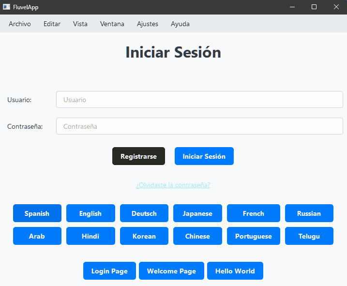
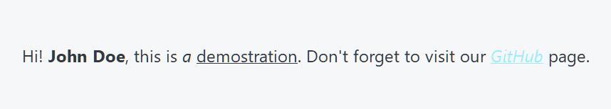

<div align="center">

<picture>
  <source media="(prefers-color-scheme: dark)" srcset="./assets/logo-dark.svg">
  
</picture>


</div>

<p align="center">A modern, declarative framework for creating user interfaces with PySide6</p>

## ⚠️ Current Status: Beta Version (0.1.0b1)
**Fluvel** is in an early stage of development.

This is a preliminary version released for testing and feedback purposes. The API may change, and you may encounter bugs or incomplete features. It is not recommended for use in production environments.

## What is **Fluvel**?
**Fluvel** is a framework built on **PySide6** that seeks to simplify and modernise the development of desktop applications in Python.
Its main philosophy is to reduce repetitive code (boilerplate) and allow developers to create complex interfaces in a more intuitive and maintainable way.

<table>

<tr>
<td>

### Key Features

* **Declarative View Creation**: Design `views` with `AbstractView`, an abstract class that allows you to define interfaces in a simple, declarative, and intuitive way using context handlers.
* **Reactive UI**: Use a system of `StringVars` to automatically update the interface when data changes. You do not need to manipulate widgets directly.
* **Utility-First Theme Engine (QSS)**: The appearance of applications is customised with QSS files. Fluvel uses a system of ‘classes’ (style=‘primary’) inspired by frameworks such as Tailwind CSS or Bulma CSS, allowing for quick and consistent design.
* **Internationalisation (i18n)**: Manage all static and dynamic content from `.fluml` files. This makes it easy to translate and adapt content without having to modify the code.
* **Integrated Routing System**: Easily manage transitions between different views (screens) within your application using a dedicated system.
* **Content Separation**: Menu content, labels, and help texts are managed outside of the code, allowing designers or translators to work independently.
* **Integrated CLI**: Features a CLI with useful commands that streamline and facilitate application development and deployment.
* **Rapid Development Cycle (Hot-Reloader)**: Incorporates a Hot-Reloading System that updates views instantly without having to reload the entire application, which speeds up design and customisation of widgets and themes using QSS and text content via `.fluml` files.

</td>
</tr>

<tr>
<td>

<div align="center">



*Example of Fluvel's internationalisation system. The entire interface, including menus, is translated instantly, all managed from separate `.fluml` and `.xml` files. [See source code](playground/example_app/views/login.py)*
</div>

</td>
</tr>
</table>


## 🚀 Quick Start

### 1. Installation (from TestPyPI)
To install this beta version, use the following command:
```powershell
# 1. Create a Python Environment
python.exe -m venv venv

# 2. Activate venv
venv/Scripts/Activate

# 3. Install Fluvel from PyPi
pip install --extra-index-url https://test.pypi.org/simple/ fluvel

# 4. Verify correct installation with pip list
pip list
```

### 2. Run a few commands to start using **Fluvel**
```powershell
# 1. Create the project structure
fluvel startproject

# 2. Run the application
fluvel run
```

## Basic Concepts

### `XML`, the language for application menus
Fluvel takes advantage of the nesting nature of menus to manage them logically and declaratively in external files. To do this, it uses the `xml` language and defines the [structural rules](docs/md/parsers/xml-rules.md). 

```xml
<!-- in ./static/content/en/menus/main-menu.xml -->

<window-menu-bar>
  <menu id="file_menu" text="File">
    <o id="new_file">New File</o>
    <o id="new_window">New Window</o>
    <o id="new_from_template">New from Template</o>

    <sep/>
    <o id="open_file">Open...</o>
    <o id="open_recent">Open Recent</o>

    <sep/>
    <submenu id="show_windows" text="Show Windows">
      <o id="toolbar">Toolbar</o>
      <o id="sidebar">Sidebar</o>
      <o id="rulers">Rulers</o>
      <o id="grid">Grid</o>
      <o id="status_bar">Status Bar</o>
    </submenu>

    <sep/>
    <o id="quit">Quit</o>
  </menu>
</window-menu-bar>
```
*A brief demonstration of building typical application menu bars using the `xml` language.*
*You can consult the [syntactic rules](docs/md/parsers/xml-rules.md) for creating the menu bar.*

### `Fluml`, the language for managing the textual content of applications
The `fluml` language and, consequently, its `.fluml` extension is a DSL specific to **Fluvel** with a syntax similar to **Markdown** designed to manage the static text content of the PySide6 application, i.e., the text displayed in Labels, Buttons, and other Text Widgets. You can learn about its [style and functionality rules](#style-and-functionality-rules) or view its [syntactic rules](./docs/md/parsers/fluml-rules.md) directly.

## Style and functionality rules
| Style           | Syntax            | Example                                              | Result in a Label                                          |
|-----------------|-------------------|------------------------------------------------------|------------------------------------------------------------|
| Italic          | `* *`             | `*This text is italicized*`                          |[see result](assets/images/lbl-italic.png)                  |
| Bold            | `** **`           | `**This is bold text**`                              |[see result](assets/images/lbl-bold.png)                    |
| Bold and Italic | `*** ***`         | `****This text is in bold and italics****`           |[see result](assets/images/lbl-bold-and-italic.png)         |
| Underline       | `__ __`           | `__This text is underlined__`                        |[see result](assets/images/lbl-underline.png)               |
| Line Through    | `-- --`           | `--This was mistaken text--`                         |[see result](assets/images/lbl-line-through.png)            |
| Subscript       | `<sub> </sub>`    | `This is a <sub>subscript</sub> text`                |[see result](assets/images/lbl-sub.png)                     |
| Superscript     | `<sup> </sup>`    | `This is a <sup>superscript</sup> text`              |[see result](assets/images/lbl-sup.png)                     |
| Link            | `{text \| url}`   | `Check our {GitHub \| https://www.github.com} page.` |[see result](assets/images/lbl-link.png)                    |
| Placeholders    | `$0, $1, etc..`   | `Hello! my name is $0.`                              |[see result](assets/images/lbl-placeholder.gif)             |

<table>

<tr>
<td>

#### Example in `.fluml` files
```
[combined-styles]:
    Hi! **$0**, this is *a* __demostration__. Don't forget to visit our *{GitHub | https://www.github.com}* page.
```
</td>
</tr>

<tr>

<td style="text-align: left; vertical-align: top; padding-right: 20px;">

#### Use in Python `views`

```python
from fluvel import View
from fluvel.components import StringVar

class MyView(View):

  def build_ui(self):

    with self.Vertical(self.container) as v:

      # You can replace the marker $0 with simple text
      my_name = "John Doe"
      v.Label(text=["combined-styles", my_name], style="h2")

      # or use StringVar
      variable_name = StringVar("John Doe")
      v.Label(text=["combined-styles", variable_name], style="h2")

      # The label reacts to changes in the StringVar
      # and updates automatically
      variable_name.value = "Other name"
```
*Using a list `[]` in the `text` parameter indicates that you want to access*
*a specific block of text from a `.fluml` file, so its first element corresponds*
*to the content ID and the following elements replace the placeholders ($0, $1, etc.).*

</td>
</tr>

<tr>
<td style="vertical-align: top;">

  #### Result in a `Label`
  
</td>
</tr>
</table>

## Roadmap
With the base of core systems already developed ([key features](#key-features)), Fluvel now needs to expand them to encompass and expose the broad PySide6 ecosystem. 
Therefore, here are some of the goals in mind.

* **Utility and Frontend API**
  * **Expansion of the F-Widgets Library**: Fluvel needs to cover the broad spectrum of `QWidgets` and expose a simple API on them.
  * **Development of Systems for Coverage of the `QtGui` Module**: You can see a glimpse of this in the Animator, Factory, and Customizer modules in the fluvel/composer directory. The central concept is to centralize and simplify the graphic component design philosophy proposed by PySide6.

* **Core API**
  * **Automatic Translation System**: Through the use of the google-cloud-translate or deepl translation APIs, a configuration file, and the translate command, the system will automatically generate complete, ready-to-use translations from your .fluml and .xml content, transforming i18n into a near zero-effort task.
* Documentation
  **Comprehensive Documentation**: Implementation of Sphinx-rST documentation, built directly from high-quality Docstrings, covering API references, in-depth tutorials, and best practices for developing scalable applications with Fluvel.
## Licence
Fluvel is distributed under the MIT Licence.